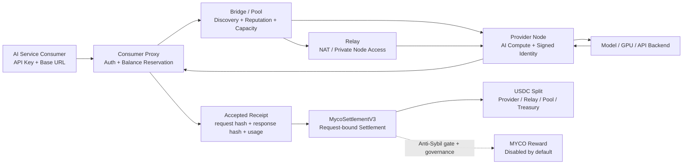

# MYCO 协议创新项目报名方案

> 提交前仅需补齐队伍信息、赛道赛区赛题和真实试点数据。本稿按“我是项目方”的口径撰写，核心定位为去中心化 AI 算力协议。

## 文档命名建议

【赛道-赛区-赛题】队伍名-MYCO去中心化AI算力协议-队长姓名ERP-队长所在BGBU/体系

## 队伍介绍

队伍名称：（待填写）

队伍队长：（待填写）例：张三zhangsan（京东零售）

队伍成员：（待填写）例：王五wangwu（京东科技）、李四lisi（京东健康）

队伍 slogan：让每一次 AI 推理都成为可验证、可结算、可激励的有价值 PoW

## 项目简介

项目名称：MYCO Protocol：去中心化 AI 算力协议

项目简介：

MYCO 是一个面向 AI 推理时代的去中心化算力协议。我们借鉴 BTC 的 PoW、矿工激励、稀缺发行和网络共识机制，但不把算力消耗在哈希竞赛上，而是把算力投入用户真实需要的 AI 推理任务。用户以标准 API 使用 AI 服务，节点完成推理并生成可验收回执，协议按授权回执分配稳定币服务费；MYCO 奖励默认关闭，待抗 Sybil 和质量信号成熟并经延迟治理启用后，才作为附加激励，形成“需求付费-算力供给-结果验收-协议结算”的闭环。

## 项目亮点

### 核心痛点

1. AI 算力正在成为新的基础设施，但供给仍高度中心化。用户面对单一供应商的价格、可用性、访问限制和供给波动，缺少一个开放、可替换、可竞争的算力网络。
2. 大量已购买但未充分使用的 Codex/AI 额度、GPU 资源、企业私有模型和个人算力无法低成本接入统一市场。它们缺少可信身份、任务定价、验收回执、防重放、分账和长期激励机制。
3. 传统 PoW 证明了“开放矿工网络 + 稀缺发行 + 经济激励”的力量，但 BTC 的哈希计算只服务于账本安全，不能直接交付业务结果。AI 时代需要一种把 PoW 变成真实生产力的协议。

### 关键创新点

1. 有价值的 PoW：BTC 的矿工通过计算哈希获得记账权和区块奖励；MYCO 的 Provider 通过完成用户付费的 AI 推理获得稳定币服务费，并在抗 Sybil 机制成熟后参与受治理的 MYCO 激励。算力不再只是“燃烧”，而是产生可被用户验收的结果。
2. 不做新公链，专注算力协议：MYCO 使用现有区块链完成资产托管、稳定币结算、奖励发行和国库治理，协议自身负责节点发现、任务分发、结果验收、有效工作计量和奖励分配。
3. 链下执行、链上结算：提示词、响应内容和推理过程留在链下，链上只记录 receipt hash、accepted hash、token 用量、价格哈希、分账结果和 MYCO 奖励，兼顾隐私、性能、成本和可审计性。
4. 稳定币收入优先、MYCO 激励受控：用户用稳定币为真实 AI 服务付费，节点获得即时服务收入；MYCO emission 从部署时开始按周计量、约每 208 周减半，但奖励全局默认关闭，只有完成抗 Sybil/质量信号并经过 typed timelock 后才启用。

## BTC 原理类比与 MYCO 价值主张

BTC 的核心价值不在于单次哈希计算本身，而在于它通过 PoW 建立了一个开放参与、难以伪造、成本可验证、发行规则清晰的全球网络。矿工投入算力，网络按规则发放 BTC；算力越强，攻击成本越高，账本越可信；减半机制让发行曲线可预期，网络共识和稀缺性共同支撑价值。

MYCO 继承这一套机制，但把工作对象从“哈希谜题”换成“AI 推理任务”。在 MYCO 中，节点投入算力不是为了争夺区块，而是为了完成用户愿意付费的模型推理。正常路径只有完成任务、返回结果并被消费者签名验收的工作才参与完整服务费分账；奖励仍保持关闭，直至签名完整性之外的抗 Sybil 与质量信号落地。

因此，MYCO 的协议价值来自四层叠加：

1. 真实需求：AI 推理是用户持续付费的生产性需求，不是为了奖励而制造的空转计算。
2. 开放供给：更多 Provider 接入后，网络获得更强的价格竞争、地域覆盖、冗余能力和抗单点故障能力。
3. 可验证结算：每次有效推理都有请求哈希、响应哈希、验收哈希、价格哈希和签名回执，服务收入可以被批量结算。
4. 稀缺激励：MYCO emission 按部署相对 epoch 管理并约四年减半；奖励启用需要延迟治理、暂停即时，避免在有效工作信号不足时把签名回执误当成不可伪造的质量证明。

一句话概括：BTC 是用 PoW 保护账本，MYCO 是用 PoW 生产 AI 服务；BTC 证明“算力可以组织成全球经济网络”，MYCO 让这张网络开始交付可被业务直接使用的算力结果。

## 价值贡献

MYCO 通过协议化方式聚合已购买但未充分使用的 Codex/AI 额度、本地模型和 GPU 算力，让闲置供给变成低价可交易服务。以单个 Provider 闲置 5 小时 Codex Pro 额度为例，若按同等任务直接走 API 的等价成本为 100 元，MYCO 可按闲置供给出清价 25 元提供给使用者，使用者成本从 100 元降至 25 元，下降 75%。Provider 原本这 5 小时闲置额度收入为 0，接入网络后按 85% 分成可获得 21.25 元额外收入；这笔收入对单个 Provider 不需要很高，但实现了闲置额度从“浪费”到“可变现”。协议 Treasury 按 10% 捕获 2.5 元收入，Relay/Pool 按 5% 获得网络服务分成。若试点阶段聚合 100 个 Provider、每个周期各释放 5 小时闲置额度，则使用者 API 等价成本约 10000 元，MYCO 结算成本约 2500 元，整体节省 7500 元；Provider 合计新增收入约 2125 元，协议收入约 250 元。所有有效调用以 accepted receipt 计量，生产环境以合规可提供的 AI 后端和算力资源为准。

用户规模按“每名使用者每月消耗 1 个 5 小时等价包”保守测算：试点期 100 名付费使用者，对应 MYCO 月结算额 2500 元，Provider 新增收入 2125 元，协议收入 250 元；增长期 1000 名付费使用者，对应月结算额 2.5 万元，Provider 新增收入 2.125 万元，协议收入 2500 元；规模期 1 万名付费使用者，对应月结算额 25 万元，Provider 新增收入 21.25 万元，协议收入 2.5 万元，年化协议收入约 30 万元。若重度用户月均消耗 3 个等价包，则上述协议收入和 Provider 新增收入同步放大 3 倍。MYCO 的收入增长来自有效推理结算规模扩大，而不是提高单个 Provider 收益；单个 Provider 只需获得一笔小额额外收入，使用者即可获得明显低于 API 原价的服务成本。

## 方案介绍

MYCO 采用五层架构：Consumer Proxy、Bridge/Pool、Provider、Relay、Settlement。用户侧只看到标准 API 地址和密钥，Proxy 在请求进入时完成账户鉴权、余额预留和任务路由。Bridge/Pool 维护已签名 Provider 节点目录、心跳、容量、支付地址和信誉数据；Relay 解决 NAT 或内网节点接入问题。Provider 校验消费者签名，并在同一 confirmed block 读取 V3 pricing hash、链上 quote 和绑定具体 request hash 的 reservation；任一不一致即拒绝。Proxy 验证 Provider 身份和响应签名，生成 accepted receipt，记录请求/响应哈希、token 用量、费用、桥接路径和双方地址。MycoSettlementV3 基于 EIP-712 双签或 receipt-scoped delegation 完成预付费扣款、Provider/Relay/Pool/Treasury 分账、批量结算和 typed 延迟治理；consumer 拒绝最终签名时，provider fallback 只执行预授权基础费，不作为质量验收。

### 架构图

## 当前实现与验证情况

- 协议层已实现 Provider 节点身份、消费者请求签名、Provider 响应签名、request-bound 链上预留、confirmed-block pricing/quote 校验、request_id 防重放和 accepted receipt。
- 网络层已实现 Bridge/Pool 节点发现、Provider 心跳、节点容量、信誉路由、Relay 中继、多 Bridge 聚合和去重。
- 产品层已实现 Consumer Proxy，用户可以用兼容 AI API 的 base_url + api_key 调用网络，不需要每次请求都签钱包或发链上交易。
- 结算层已实现 MycoSettlementV3：严格稳定币余额差、预付费锁定、request-bound reservation、双签/委托回执、provider minimum-fee fallback、批量分账、部署相对 epoch、默认关闭的奖励和 typed 延迟治理。
- 部署层已支持 Bridge、Provider、Proxy、Relay 分角色 Docker Compose 启动，并提供 Sepolia V3 测试部署流程；历史 V2 记录仅用于迁移兼容。
- Python 与 Solidity 测试覆盖协议/网关、V3 ABI、request 绑定、报价校验、fallback、治理和奖励失败隔离；发布时以当前 CI/本地测试输出为准，不在方案中固化易过期的用例数量。

## 商业与协议模型

MYCO 的商业模型不是单纯转售 API，而是把 AI 推理抽象成可计量的协议工作单元。用户为推理结果支付稳定币，Provider 将闲置额度、模型能力或算力资源接入网络并获得服务费，Relay 和 Pool 因提供网络连通与发现能力获得分成，Treasury 捕获协议收入。MYCO 奖励并非稳定币结算的前提，当前默认关闭；未来只有在 accepted receipt 之外加入抗 Sybil/质量信号并通过延迟治理后才启用。

短期阶段，MYCO 以 allowlist testnet 方式启动，保证 Provider 身份、消费者身份、支付地址和信誉签名可控；中期通过更多业务场景接入扩大有效调用量；长期在 staking、slashing、质量抽检、争议仲裁完善后开放 permissionless Provider 加入。协议收入越多，Provider 收益越稳定，网络供给越强，用户体验越好，形成与 BTC 类似的正循环：更多节点带来更强网络，更多需求带来更多收入，更多收入反过来支撑协议资产和节点激励。

## 竞品对比与独特优势

Akash、Render Network、io.net 都在做去中心化算力，但它们的核心供给侧资产主要是 GPU/CPU 云资源。Akash 更像去中心化云市场，用户租用 GPU、CPU、内存和容器环境；Render Network 起步于分布式 GPU 渲染，并扩展到生成式影像和 AI 计算；io.net 更强调分布式 GPU/CPU 集群、Ray/Kubernetes/容器和高性能计算调度。它们解决的是“如何把分散硬件组织成可租用算力”。

MYCO 的独特优势是供给侧资产不同：我们优先聚合的是已购买但未充分使用的 Codex/AI 订阅额度、API 额度、本地模型能力和轻量算力，而不是只和大型 GPU 市场竞争 H100/A100 价格。很多 Provider 的 Codex Pro、AI API 包月额度或本地模型能力已经付费，闲置时收入为 0；MYCO 把这部分边际成本很低的供给转成 accepted inference service。对 Provider 来说只是小额额外收入，对使用者来说却可以显著低于 API 原价。

第二个优势是产品抽象不同：Akash/io.net 更偏“租机器、跑容器、建集群”，Render 更偏“提交渲染或创意计算任务”。MYCO 面向的是最终 AI 推理服务，用户只需要 base_url + api_key，不需要选择 GPU 型号、部署容器、维护集群或管理模型运行环境。我们卖的不是裸算力时长，而是被验收的 AI 推理结果。

第三个优势是结算单位不同：传统算力网络更容易按 GPU 小时、容器租期或任务作业计费；MYCO 正常路径按 request-bound accepted receipt 计量并完成完整稳定币分账。consumer 拒签时只允许执行预授权 minimum fee fallback，且不发奖励。MYCO 奖励要在抗 Sybil 和质量信号落地后才可经延迟治理启用，因此当前回执证明的是请求、响应、授权和付款完整性，而不是不可伪造的模型质量。

因此，MYCO 不需要在早期正面挑战 Akash、Render、io.net 的硬件规模，而是切入它们覆盖不足的“AI 额度闲置市场”。这部分供给更碎片、更轻量、更接近终端用户，但价格弹性更强。我们的竞争壁垒是：OpenAI 兼容入口、Provider 低门槛接入、request-bound receipt、稳定币分账，以及通过安全门槛后可治理启用的 MYCO 激励形成的一体化协议闭环。

## 3 分钟视频讲解脚本

第一段，痛点：AI 算力正在成为新基础设施，但今天的供给还是中心化的。价格、可用性、访问策略和算力冗余都由少数供应商决定，大量分散模型和算力无法进入统一市场。

第二段，类比 BTC：BTC 证明了 PoW 可以组织全球矿工网络，用算力、稀缺发行和经济激励维护可信账本。但 BTC 的算力主要用于哈希计算。MYCO 做的是下一代有价值 PoW：节点的算力直接完成用户付费的 AI 推理任务。

第三段，方案：用户仍然用 API Key 和 Base URL 调用服务。MYCO 在后台完成节点发现、信誉路由、request-bound 余额预留、Provider 推理、结果签名、用户验收和链上结算。每一次被验收的推理都会生成 receipt，作为稳定币服务费分账依据；奖励默认关闭，等待更强的有效工作信号。

第四段，价值：对用户，MYCO 提供更开放、更抗单点、更可竞争的 AI 算力入口；对 Provider，MYCO 提供新的算力变现渠道；对协议，MYCO 先用真实 AI 服务收入建立可持续结算，再在抗 Sybil 和质量机制成熟后引入有用工作激励，让 PoW 从能源成本变成生产性算力网络。

## 评审自查

当前项目应按 A 级渐进式创新申报，并具备冲击 S 级的叙事基础。

- 价值性：项目瞄准 AI 算力基础设施，解决中心化供给、闲置额度变现、服务使用者降本、协议收入捕获和节点激励问题，经济收益和技术指标均可量化。
- 创新性：项目不是普通代理网关，而是把 BTC 的 PoW 激励思想迁移到 AI 推理场景，形成 Proof of Useful Inference。
- 可行性：代码已覆盖网络、计费、路由、回执、结算、合约和测试网部署路径，具备演示和试点基础。

冲击 S 级还需要补强三点：

- 补充真实业务或外部试点数据，例如有效调用量、成本差异、RT、可用性、Provider 数量、结算金额。
- 沉淀协议规范和安全边界，例如 staking/slashing、质量抽检、争议仲裁和开放 Provider 准入规则。
- 明确生态建设路径，例如 Provider 招募、开发者接入、SDK、节点收益看板和治理路线图。
