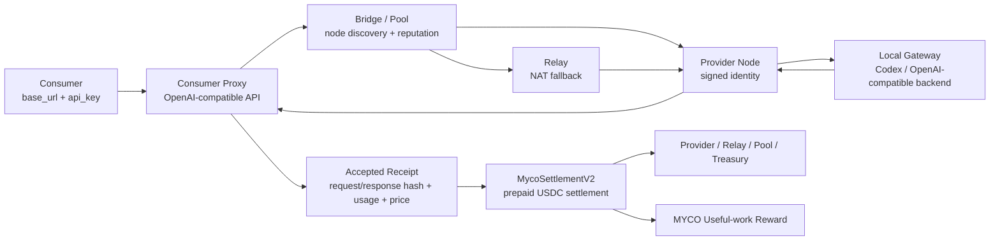

# MYCO 协议创新项目报名方案

> 使用说明：本文档已按报名模板整理。队伍信息、赛道赛区赛题、真实试点数据需要在提交前补齐；“附录”可按报名系统篇幅要求保留或删除。

## 文档命名建议

【赛道-赛区-赛题】队伍名-MYCO 协议去中心化 AI 推理服务网络-队长姓名ERP-队长所在BGBU/体系

## 队伍介绍

队伍名称：（待填写）

队伍队长：（待填写）例：张三zhangsan（京东零售）

队伍成员：（待填写）例：王五wangwu（京东科技）、李四lisi（京东健康）

队伍 slogan：让 AI 推理从“中心化调用”升级为“可计量、可结算、可协作的有用工作网络”

## 项目简介

项目名称：MYCO 协议：去中心化 AI 推理服务网络与 OpenAI 兼容网关

项目简介：

MYCO 协议面向多智能体与 AI 代码执行场景，在现有区块链之上构建去中心化推理服务网络。用户仍以 OpenAI 兼容 base_url+api_key 调用服务，后台完成节点发现、任务路由、预付费预留、验收回执、USDC 分账与 MYCO 有用推理奖励，实现 AI 算力供给、质量验收和经济结算的协议化闭环。

## 项目亮点

### 核心痛点

1. AI 推理与代码自动化能力高度依赖单一中心化服务，企业在成本、可用性、地域访问、供应商锁定和弹性扩容上缺少协议级选择权。
2. 分散的个人或团队 AI 额度、GPU/模型服务、Codex 执行环境难以安全接入统一市场，缺少节点身份、任务验收、计费分账和防重放机制。
3. 现有 AI 代理多数只解决请求转发，不解决“谁完成了有效工作、用户是否接受结果、如何按真实使用结算、如何形成长期激励”的经济闭环。

### 关键创新点

1. 提出 Proof of Useful Inference 机制：不做新公链，不争夺出块权，而是在现有链上用稳定币与 MYCO 记录和激励已验收的真实 AI 推理工作。
2. 构建 Consumer Proxy、Bridge/Pool、Provider、Relay、Settlement 五层架构，用户侧保持 OpenAI 兼容接口，网络侧完成签名发现、信誉路由、预付费、回执验收和批量结算。
3. 将链下推理结果与链上结算解耦：提示词和响应留在链下，链上只保存 receipt hash、accepted hash、token 用量、分账规则和奖励结果，兼顾隐私、成本与可审计性。

## 价值贡献

建议按“效率 + 成本 + 技术类 + 收入潜力”组合申报。试点期以“自动化率、需求交付周期、响应时间 RT、可用性、技术服务收入”为核心指标：通过 OpenAI 兼容代理降低业务接入成本，目标将多节点接入改造从定制开发降为标准 URL+Key 配置；通过 Provider 池化与信誉路由提升可用性；通过预付费和验收回执降低坏账与人工对账成本。收入测算可按“技术服务收入=有效调用量*单次服务单价”或“收入=签约客户数*合同金额”统计。

## 方案介绍

MYCO 协议采用“链下执行、链上结算”的分层方案。Consumer Proxy 对用户暴露 `/v1/chat/completions`、`/v1/responses`、`/v1/models` 等 OpenAI 兼容接口，并基于账户余额先预留费用。Bridge/Pool 维护已签名 Provider 节点目录、心跳、容量与信誉数据，Proxy 按成功率、验收数、结算数、延迟和争议记录进行路由。Provider 节点持有 Ed25519 身份，校验消费者签名、支付预留、pricing hash、request_id 防重放后，调用本地 Codex/OpenAI 兼容后端完成推理。结果返回后由 Provider 签名，Proxy 校验响应并生成 accepted receipt，记录请求哈希、响应哈希、token 用量、价格、消费者/提供者地址和桥接路径。MycoSettlementV2 合约支持预付费余额、EIP-712 签名回执、委托结算、批量结算、USDC 分账、国库收入、MYCO epoch 奖励和回购销毁治理钩子。

### 架构图

## 当前实现与验证情况

- 已实现 OpenAI 兼容网关、多智能体会话隔离、Codex 后端桥接、Consumer Proxy、Provider、Bridge/Pool、Relay、路由信誉、预付费计费、回执账本、链上索引同步和部署脚本。
- 已实现 MycoSettlementV2：预付费余额、提款、签名回执结算、委托结算、批量结算、epoch 奖励上限、治理延迟、国库回购销毁。
- 已提供 Docker Compose 角色化部署，Bridge、Provider、Proxy、Relay 可由不同操作者独立运行。
- 测试结果：Python 协议/网关单测 171 个通过；Foundry 离线合约测试 14 个通过。普通 `forge test` 在本机 Foundry 读取 macOS 系统代理配置时 panic，使用 `forge test --offline` 通过。
- 已有 Sepolia V2 部署记录：settlement、MYCO token、test USDC 与 `codex-standard-v1` channel hash 已写入 `deployments/sepolia-myco-v2.json` 和部署文档。

## 指标口径建议

| 指标一级分类 | 指标名称 | 指标属性 | 建议口径 | 试点目标写法 |
| --- | --- | --- | --- | --- |
| 收入 | 技术服务收入 | 经济量化-定量 | 技术服务收入 = 有效调用量 * 单次服务单价，或签约客户数 * 合同金额 | 以内部试点或外部测试网客户签约/调用数据核算 |
| 成本 | 人工成本费用 / 每月节约 HC 数 | 经济量化-定量 | 成本节约 = 节约 HC 数 * 单位人力成本 | 节约接入、对账、结算、运维排障的人工作业 |
| 效率 | 自动化率 | 非经济量化-定量 | 自动化率 = 自动化任务数 / 总任务数 * 100% | 用户注册、充值、路由、验收、回执、结算链路自动化 |
| 效率 | 需求交付周期 | 非经济量化-定量 | 需求交付周期 = 需求完成时间 - 需求受理时间 | 新 Provider/业务接入从定制联调收敛为标准配置 |
| 体验 | 大模型有效使用次数 | 非经济量化-定量 | 有效使用次数 = 已完成且 accepted 的调用次数 | 以 accepted receipt 作为有效使用的统一口径 |
| 技术类 | 响应时间 RT | 技术类-定量 | 单次请求从 Proxy 接收至返回的端到端耗时 | 路由策略按延迟、失败率和验收率动态优化 |
| 技术类 | 可用性 | 技术类-定量 | 可用性 = 服务可用时间 / 总运行时间 * 100% | 多 Bridge、多 Provider、Relay 兜底提升可用性 |
| 技术类 | 每秒查询率 QPS / 吞吐量 | 技术类-定量 | 单位时间内可处理的推理请求数 | Provider capacity 与路由租约控制并发上限 |

## 评审自查

建议定位：A 级渐进式创新，具备冲击 S 级的技术叙事基础。

为什么当前更适合 A 级：

- 价值性：解决 AI 服务接入、供应商锁定、可用性、计费结算和多节点协同问题，ROI 可以通过调用收入、节省 HC、自动化率和可用性量化。
- 创新性：不是普通 AI 代理，而是把节点身份、有效推理验收、预付费、签名回执、稳定币分账和 MYCO 激励结合为协议闭环。
- 可行性：当前代码已覆盖网关、P2P、Pool、Relay、计费、合约和测试网部署路径，具备演示与试点基础。

冲击 S 级需要补强：

- 真实业务场景：补充京东内部具体业务试点，例如研发多智能体执行、营销素材生成、客服知识问答、算法评测等。
- 量化收益：补充试点前后有效调用量、接入周期、人力节约、稳定性、成本下降或收入转化数据。
- 壁垒材料：补充协议规范、关键安全设计、节点生态计划、开源/专利/内部平台化沉淀。

## 报名材料待补齐清单

| 优先级 | 待补充项 | 建议 |
| --- | --- | --- |
| P0 | 队伍名称、队长、成员、赛道赛区赛题 | 与报名平台完全一致 |
| P0 | 真实业务场景 | 选择一个最容易证明价值的场景，不要只讲通用协议 |
| P0 | 基线数据 | 至少补齐接入周期、人工对账耗时、调用量、失败率、RT 或成本中的 2-3 项 |
| P1 | 演示视频脚本 | 3 分钟内展示用户 URL+Key 调用、Provider 接单、receipt 生成、链上结算 |
| P1 | 架构图图片版 | 将本文 Mermaid 转为图片后插入报名文档 |
| P2 | 风险与规划 | 写清 open profile 依赖 staking、slashing、争议仲裁后才开放 |
